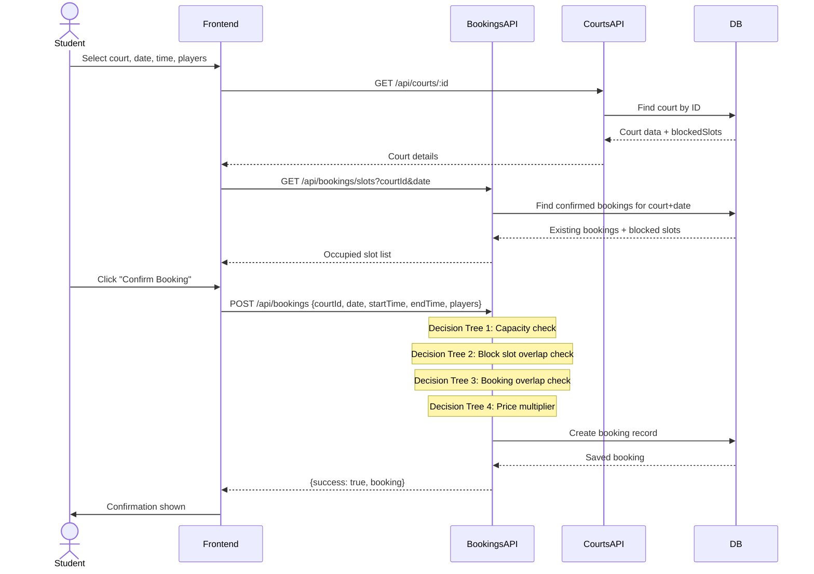

# 🏟️ Sports Facility Booking System
### Campus Sports Reservation Platform — Full Project Presentation

---

## 1. 🎯 Project Overview

**Sports Facility Booking System** is a full-stack web application that digitizes campus sports court reservations across Telangana universities. It allows students to discover nearby venues, check real-time slot availability, and make instant bookings — all from one dashboard.

| Attribute | Value |
|-----------|-------|
| **Domain** | EdTech × Sports Management |
| **Target Users** | University students, sports admins |
| **Region** | Hyderabad & Telangana campuses |
| **Sports Covered** | 🎾 Tennis · 🏀 Basketball · 🏸 Badminton · ⚽ Football · 🏐 Volleyball · 🎱 Squash · 🏏 Cricket |
| **Tech Stack** | React + Vite (Frontend) · Node.js + Express (Backend) · MongoDB / In-memory (DB) |
| **Deployment** | Vercel (Frontend) · Render (Backend) |

---

## 2. 🏗️ System Architecture

```mermaid
graph TB
    U[👤 Student / Admin] --> FE[React Frontend\nVite + Framer Motion]
    FE --> |REST API calls| BE[Express Backend\nNode.js]
    BE --> |reads/writes| DB[(MongoDB Atlas\nor In-Memory MockDB)]
    BE --> AUTH[JWT Auth Middleware]
    BE --> ROUTES[API Routes]
    
    ROUTES --> R1[/api/auth\nRegister · Login]
    ROUTES --> R2[/api/courts\nCRUD · Near · Block]
    ROUTES --> R3[/api/bookings\nCreate · Cancel · Slots]
    ROUTES --> R4[/api/analytics\nUsage · Heatmap · Suggestions]
    ROUTES --> R5[/api/admin\nSummary · Users · Courts]
    
    FE --> P1[🏠 Home]
    FE --> P2[🏟️ Venues]
    FE --> P3[📅 BookingPage]
    FE --> P4[📊 Dashboard]
    FE --> P5[🔐 Login / Register]
```

---

## 3. 💼 Core Business Logic

### 3.1 — Dynamic Pricing Engine (Decision Tree Core)

The heart of the system is a **time-based pricing multiplier** applied at booking creation time. This IS the Decision Tree in action:

```
START: User selects startTime
         │
         ▼
  Is hour >= 16 AND < 21?  (4 PM – 9 PM)
     ├── YES → PEAK HOURS      → Price × 1.0  (Full price)
     └── NO  ↓
         │
  Is hour >= 7 AND < 10?    (7 AM – 10 AM)
  OR Is hour >= 21 AND < 22? (9 PM – 10 PM)?
     ├── YES → MODERATE HOURS → Price × 0.9  (10% discount)
     └── NO  → OFF-PEAK HOURS → Price × 0.8  (20% discount)
```

**Code** — [`bookings.js` L79–84](file:///c:/Users/nagen/Summerpro/backend/routes/bookings.js#L79-L84):
```js
const getPriceMultiplier = (startStr) => {
  const h = parseInt(startStr.split(':')[0], 10);
  if (h >= 16 && h < 21) return 1.0;   // Peak hours: full price
  if ((h >= 7 && h < 10) || (h >= 21 && h < 22)) return 0.9; // Moderate: 10% off
  return 0.8;                           // Off-Peak: 20% off
};
const price = duration × court.pricePerHour × getPriceMultiplier(startTime);
```

---

### 3.2 — Slot Conflict Resolution

Before any booking is confirmed, the system runs **two sequential guards**:

1. **Admin-blocked slots check** — Iterate `court.blockedSlots[]`, compute time overlap using the `overlap()` function
2. **Existing bookings check** — Filter confirmed bookings for the same court+date, reject overlaps

```
overlap(s1, e1, s2, e2) = toMinutes(s1) < toMinutes(e2) AND toMinutes(s2) < toMinutes(e1)
```

This is the classic interval overlap algorithm — O(n) per booking creation.

---

### 3.3 — Cancellation & Refund Policy (Decision Tree)

```
Cancellation Request
         │
  Is requester ADMIN?x
     ├── YES → Full Refund (100%)
     └── NO  ↓
         │
  Hours until session start >= 12h?
     ├── YES → Full Refund (100%)
     └── NO  ↓
         │
  Hours until session start >= 6h?
     ├── YES → Partial Refund (50%)
     └── NO  → No Refund (0%)
```

**Code** — [`bookings.js` L123–134](file:///c:/Users/nagen/Summerpro/backend/routes/bookings.js#L123-L134):
```js
if (req.user.role === 'admin') {
  refund = booking.totalPrice;       // Admin → 100%
  refundStatus = 'full';
} else if (hoursDiff >= 12) {
  refund = booking.totalPrice;       // >12h away → 100%
  refundStatus = 'full';
} else if (hoursDiff >= 6) {
  refund = booking.totalPrice * 0.5; // 6–12h away → 50%
  refundStatus = 'partial';
}
// else → refund = 0, refundStatus = 'none'
```

---

### 3.4 — AI Slot Suggestion Engine (Decision Tree + Heuristics)

The `/api/analytics/suggestions` endpoint generates smart booking recommendations:

```
For each court:
  FOR hour h = 6 to 22:
    bookingCount = count of bookings at this hour
    │
    Is bookingCount > 3?
       ├── YES → "High Usage" (skip — already busy)
       └── NO  ↓
           │
    Is h in [16..21)?  (Peak window)
       ├── YES → "Peak"     → discount = 0%
       └── NO  ↓
           │
    Is h in [7..10) or [21..22)?  (Moderate window)
       ├── YES → "Moderate" → discount = 10%
       └── NO  → "Off-Peak" → discount = 20%
    │
    Track off-peak slots with lowest booking count
    ─────────────────────────────
    BEST SLOT = off-peak hour with minimum historical bookings
    OUTPUT: "Book HH:00–HH+1:00 for best availability at [Court]"
```

---

### 3.5 — Demand Heatmap (Anomaly Detection)

The `/api/analytics/heatmap` endpoint computes per-hour demand levels:

| Condition | Level | Color |
|-----------|-------|-------|
| `demand/maxDemand >= 0.75` | 🔴 High | Red |
| `demand/maxDemand >= 0.30` | 🟡 Moderate | Yellow |
| `demand/maxDemand < 0.30` | 🟢 Quiet | Green |
| `demand / historicalAvg > 1.5` | 🚨 Anomaly spike | Alert |
| `demand / historicalAvg < 0.5` | ⬇️ Below average | Note |

**Data confidence** — Also uses a decision tree:
- `< 5 bookings` → Low confidence
- `5–19 bookings` → Medium confidence
- `>= 20 bookings` → High confidence

---

### 3.6 — Geospatial Sorting (Haversine Formula)

Venues on the Venues page are **automatically sorted by distance** from the user's GPS location using the Haversine formula:

```
d = 2R × atan2(√a, √(1-a))
where a = sin²(Δlat/2) + cos(lat₁)·cos(lat₂)·sin²(Δlng/2)
```

If GPS is unavailable, the system **defaults to Hyderabad city center** (17.3850°N, 78.4867°E) so sorting still works.

---

### 3.7 — Capacity Enforcement

```
numberOfPlayers > court.capacity?
  ├── YES → Reject with "Max capacity is X players"
  └── NO  → Proceed to slot conflict check → Create booking
```

---

## 4. 🌟 Unique Features & What Makes This Project Stand Out

### 4.1 — Dual Database Strategy (Zero-Config Demo)
The backend auto-detects whether MongoDB is available. If no `MONGODB_URI` is set, it seamlessly switches to an **in-memory mock database** (`mockDb.js`) pre-loaded with 10 courts and demo users. This means the app works out-of-the-box with NO database setup — perfect for demos and development.

```js
// utils/db.js
const isMock = () => !process.env.MONGODB_URI || !connected;
const db = () => isMock() ? require('./mockDb') : mongoose models;
```

### 4.2 — Time-Aware Dynamic Pricing
Unlike most booking systems that use flat rates, this system applies **automatic time-of-day price multipliers** — incentivizing off-peak usage and reducing congestion during high-demand evening hours.

### 4.3 — Decision-Tree-Driven AI Suggestions
The suggestion engine doesn't just show availability — it **reasons about it** using a multi-step decision tree that combines:
- Time-of-day context (peak/off-peak classification)
- Historical booking frequency (usage count per hour)
- Best-slot selection (lowest historical demand)

### 4.4 — Role-Based Access Control (RBAC)
Two distinct user roles with completely different experiences:
- **Student** — Discover venues, book slots, view own history, cancel with refund
- **Admin** — Full court CRUD, slot blocking for events, all-user booking oversight, system analytics

### 4.5 — Haversine Proximity Sorting
Real GPS-based distance calculation. Courts are sorted from nearest to farthest. No third-party mapping service needed.

### 4.6 — Campus-Focused Venue Data
Rather than generic venues, the system is built with **real Telangana university campuses** (NIT Warangal, IIIT Hyderabad, Osmania University, etc.) with actual GPS coordinates and campus-specific rules.

### 4.7 — Refund Policy Automation
The cancellation policy tree is fully automated — no admin intervention needed for routine cancellations. Refund amounts are computed and stored instantly.

### 4.8 — Demand Anomaly Detection
The heatmap engine flags **anomalous demand spikes** (>150% of historical average) and below-average demand — a basic ML-inspired insight engine built purely with arithmetic.

---

## 5. 🌳 Why Decision Trees? — The Algorithm Explained

### What is a Decision Tree?
A Decision Tree is a hierarchical sequence of **if-then-else conditions** that classifies an input into one of several output categories. It mimics how human experts make decisions — by asking a series of yes/no questions until a conclusion is reached.

```
                    [Root Node]
                   Is hour peak?
                  /             \
               YES               NO
              /                    \
         [Leaf: Peak]         Is hour moderate?
         Price × 1.0          /              \
                            YES               NO
                           /                    \
                     [Leaf: Moderate]     [Leaf: Off-Peak]
                     Price × 0.9          Price × 0.8
```

### Why Decision Trees Were Chosen for This Project

| Criterion | Reason |
|-----------|--------|
| **Interpretability** | Every pricing and refund decision can be explained step-by-step to users |
| **No training data needed** | Rules are domain-expert-defined (campus sports domain knowledge) |
| **Deterministic output** | Same input always gives same output — critical for financial transactions |
| **Low computational cost** | O(depth) = O(1) per query — scales to thousands of concurrent users |
| **Easy to update** | New pricing tiers or refund bands can be added by just adding a branch |
| **Real-time feasibility** | Runs synchronously in the HTTP request handler with zero latency |

### Decision Trees in This Project — Summary Map

| Feature | Decision Tree Nodes | Output |
|---------|-------------------|--------|
| Booking Price | 3-node tree (peak/moderate/off-peak) | Price multiplier: 0.8, 0.9, or 1.0 |
| Slot Suggestions | 4-node tree (usage + time window) | Best hour + discount recommendation |
| Cancellation Refund | 3-node tree (role + time remaining) | Refund: none / 50% / 100% |
| Heatmap Level | 2-node tree (demand ratio) | High / Moderate / Quiet label |
| Data Confidence | 2-node tree (booking count) | Low / Medium / High confidence |
| Anomaly Detection | 1-node tree (demand vs. historical) | Spike flag / Below-average flag |

### Alternative Algorithms Considered

| Algorithm | Why NOT used |
|-----------|-------------|
| **Neural Network** | Over-engineered; requires labeled training data, not interpretable to users |
| **Random Forest** | Same black-box issues; overkill for 3-class time categorization |
| **k-NN** | Needs distance metric; doesn't naturally express business policy |
| **Rule Engine (Drools)** | External dependency; too heavy for a Node.js REST API |
| **Linear Regression** | Cannot handle categorical time-period logic cleanly |

**Decision trees are the perfect fit** because the entire pricing and recommendation domain is already expressed as human-readable business rules — the algorithm just formalises that structure.

---

## 6. 📊 Data Flow — End-to-End Booking



---

## 7. 📁 Project File Structure

```
Summerpro/
├── backend/
│   ├── models/
│   │   ├── Court.js        ← Sport, price, capacity, blockedSlots, GPS
│   │   ├── Booking.js      ← User, court, time, price, refund, status
│   │   ├── User.js         ← Role, interests, feedback
│   │   ├── Facility.js
│   │   └── TimeSlot.js
│   ├── routes/
│   │   ├── auth.js         ← Register, Login (JWT)
│   │   ├── courts.js       ← CRUD, /near, /block
│   │   ├── bookings.js     ← Create, Cancel, Slots ← DECISION TREES HERE
│   │   ├── analytics.js    ← Suggestions, Heatmap, Usage ← DECISION TREES HERE
│   │   └── admin.js        ← Admin-only summary, user list
│   ├── utils/
│   │   ├── db.js           ← Auto-switch: MongoDB ↔ Mock
│   │   └── mockDb.js       ← In-memory DB with 10 pre-loaded courts
│   ├── middleware/auth.js  ← JWT verify + role guard
│   ├── seed.js             ← 21 campus courts data seed
│   └── server.js           ← Express app, port retry logic
│
└── frontend/
    ├── src/
    │   ├── pages/
    │   │   ├── Home.jsx        ← Landing page
    │   │   ├── Venues.jsx      ← Sport SVG mapping + GPS sort
    │   │   ├── BookingPage.jsx ← Slot picker + heatmap
    │   │   ├── Dashboard.jsx   ← User stats + Admin panel
    │   │   ├── Login.jsx
    │   │   └── Register.jsx
    │   ├── utils/animations.js ← Framer Motion presets
    │   └── index.css           ← Dark glassmorphism design system
    └── public/images/          ← Sport SVGs + real venue PNGs
```

---

## 8. 🔐 Security Model

| Layer | Implementation |
|-------|---------------|
| Authentication | JWT (JSON Web Tokens) signed with `JWT_SECRET` |
| Authorization | Role-based middleware (`protect` + `authorize('admin')`) |
| Password Storage | bcryptjs with salt rounds = 10 |
| CORS | Configured for frontend domain only |
| Input Validation | Mongoose schema validators + manual checks |
| Admin Endpoints | Protected with dual middleware: `protect` + `authorize('admin')` |

---

## 9. 🚀 Demo Credentials

| Role | Email | Password |
|------|-------|----------|
| 🧑‍🎓 Student | `student@demo.com` | `123456` |
| 🛡️ Admin | `admin@demo.com` | `123456` |

---

## 10. 🔮 Future Enhancements

- [ ] **ML-based price prediction** — Train a model on seasonal/historical booking data
- [ ] **Push notifications** — Remind users 1 hour before their slot
- [ ] **QR code check-in** — Physical court entry validation
- [ ] **Group booking** — Multiple users can split one booking
- [ ] **Waitlist system** — Auto-notify when a cancelled slot opens up
- [ ] **Payment gateway integration** — UPI/Razorpay for real transactions
- [ ] **Court rating & reviews** — Community-driven quality scores

---

> **Built with** React · Vite · Node.js · Express · MongoDB · Framer Motion · Lucide Icons
> **Campus Coverage** — Osmania University · JNTU · HCU · IIIT-H · CBIT · VNR VJIET · NIT Warangal · University of Hyderabad · Kakatiya University
